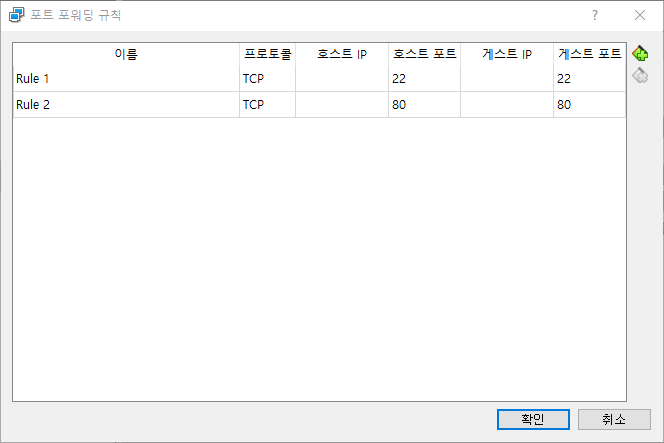
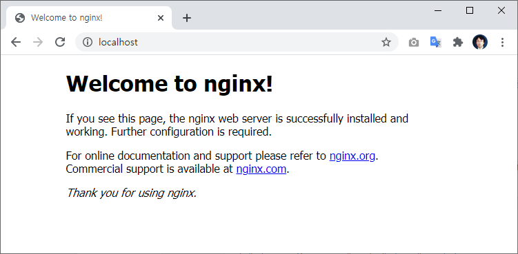

# Nginx 웹서버 설치하기


```
$ sudo apt-get install nginx
```


설치가 완료되면 간단하게 버젼을 확인해 볼 수 있습니다.

```
test@test:~$ sudo nginx -v
nginx version: nginx/1.18.0 (Ubuntu)
```


#### 아파치 vs nginx

- `Apache`: 요청마다 스레드 혹은 프로세스 생성 및 처리
- `Nginx`: 요청마다 비동기 이벤트를 발생시켜 처리


```
// 시작
$ sudo service nginx start
$ sudo systemctl start nginx
$ sudo /etc/init.d/nginx start

// 재시작
$ sudo service nginx restart
$ sudo systemctl restart nginx
$ sudo /etc/init.d/nginx restart

// 중지
$ sudo service nginx stop
$ sudo systemctl stop nginx
$ sudo /etc/init.d/nginx stop

// 상태
$ sudo service nginx status
$ sudo systemctl status nginx

// 설정 reload
$ sudo service nginx reload
$ sudo systemctl reload nginx
$ sudo nginx -s reload

// configuration file syntax check
$ sudo nginx -t
```


## nginx 설정

- package(apt-get을 통한 설치)의 경우: /etc/nginx에 위치
- 직접 compile한 경우: /usr/local/nginx/conf, /usr/local/etc/nginx
- 


#### 포트 포워딩

VirtualBox와 같은 환경을 사용할때 포트 포워딩을 추가합니다.




## 브라우저 접속

호스트 컴퓨터에서 브라우저를 이용하여 접속합니다.





만일 포트 번호를 다른번호로 변경한 경우 localhost:포트번호 형태로 입력합니다.


#### 기본포트 변경

기본적으로 80번 포트를 listen 합니다. 이를 수정하고자 할때에는 

/etc/ngnix/sites-enabled/default 의 내용을 수정합니다.

